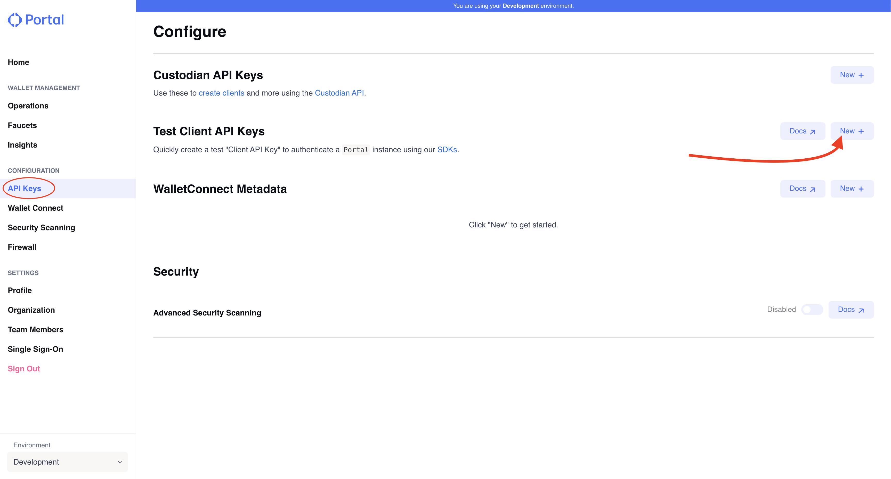
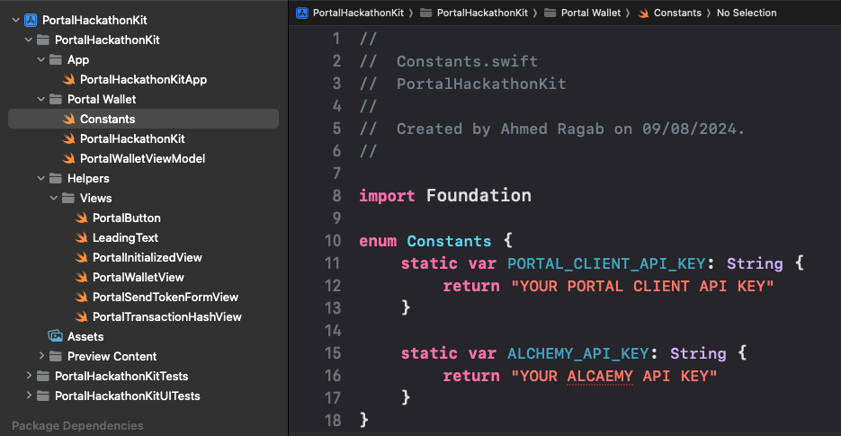
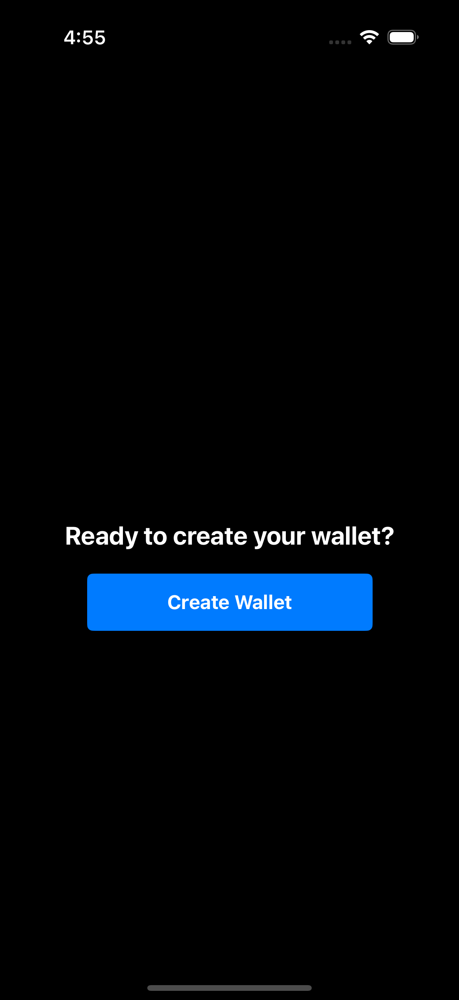
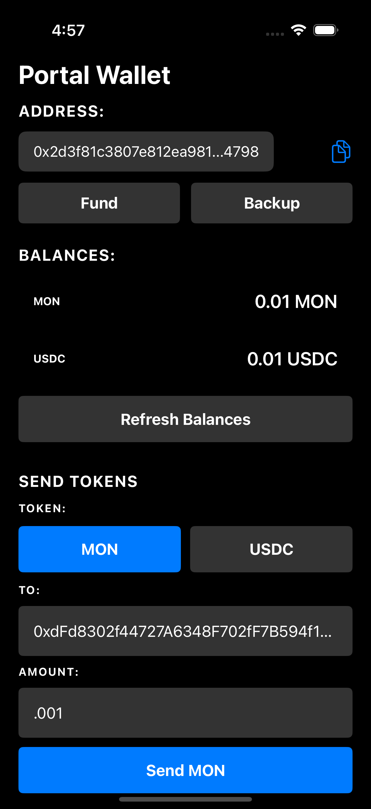
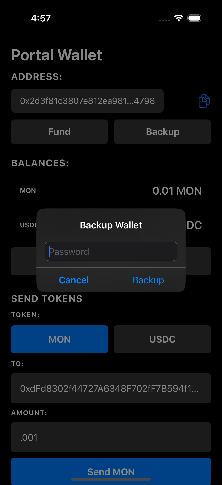

# Portal Hackathon Kit - iOS (mobil3)

This repository shows you how you can easily integrate `MON` and `USDC` into your iOS app using the [Portal iOS SDK](https://docs.portalhq.io/guides/ios) on Monad Testnet. It covers the following features.

1. Generate a Wallet
2. Fetch and display balances.
3. Transfer tokens to a given recipient address.
4. Backup the wallet with password as the key to Portal servers.
5. Recover the wallet with password as the key from Portal servers.
6. Fund wallet with MON on Monad Testnet.

Portal SDK also covers the following backup method which were not covered in this example app but you learn how to implement them through our [docs](https://docs.portalhq.io/guides/ios/back-up-a-wallet).

1. Backup with iCloud
2. Backup with GDrive
3. Backup with Passkey

## How to Run This Example App
1. Clone the repo to your local system
2. Open the project `PortalHackathonKit.xcodeproj` in your Xcode.
3. Go to your Portal Dashboard [settings page](https://app.portalhq.io/settings#client-api-keys) and create a client test API key (screenshots are attached below for your convenience).
4. Update the **PORTAL_CLIENT_API_KEY** field in `PortalHackathonKit/PortalHackathonKit/Portal Wallet/Constants.swift` with your Portal Client API Key (screenshot below).
5. Run the app and it should work without any issues.

*Note: This version uses Monad Testnet's native RPC endpoint, so no third-party RPC provider API key is needed.*

## Understanding the Example App
The Sample APP has only single screen. And is developed using simple `MVVM`, `SwiftUI`. All the Portal related implementation kept separate and generic as much as possible to be easier to understand.
Here is the project important files:

1. `PortalWalletViewModel.swift`: This is where all the **Portal SDK** logic is implemented. For more info on how to use the iOS Portal SDK please refer to [this doc](https://docs.portalhq.io/guides/ios).
2. `PortalHackathonKit.swift`: This is the SwiftUI main view that use the `PortalWalletViewModel` to execute and display all the functionality.
3. `Constants.swift`: This file contains common Portal related constants including `PORTAL_CLIENT_API_KEY` and `USDC_TESTNET_ADDRESS` for Monad Testnet.

The rest of the files are some helper Views, really simple and self explanatory (`PortalButton`, `LeadingText`, `PortalInitializedView`, `PortalWalletView`, `PortalSendTokenFormView`, `PortalTransactionHashView`)

## Monad Testnet Configuration

This app is configured to work with Monad Testnet:
- **Chain ID**: 10143 (eip155:10143)
- **Native Token**: MON
- **RPC URL**: https://testnet-rpc.monad.xyz
- **Block Explorer**: https://testnet.monadexplorer.com
- **USDC Contract**: 0xf817257fed379853cDe0fa4F97AB987181B1E5Ea

## Faucets for App Testing
To fully test this app (like for example to transfer funds) you will need to load your wallet with `MON` and `USDC` tokens on Monad Testnet. Below are some faucets that you can use.

- [Monad Testnet Faucet](https://faucet.monad.xyz) - Get testnet `MON` tokens
- App's built-in Fund Wallet feature - Get testnet `MON` tokens directly in the app

## Demos

#### Create Wallet

#### View Wallet

#### Back Up Wallet

## Portal Documentation

### Portal SDK Reference

Portal's SDKs have several pieces of core functionality.

- [Generating a Wallet](https://docs.portalhq.io/guides/ios/create-a-wallet): This function creates MPC key shares on your local device and the Portal servers. These key shares support all EVM chains and Solana.
- [Signing a Transaction](https://docs.portalhq.io/guides/ios/sign-a-transaction): This function signs a provided transaction, and can broadcast that transaction to a chain when an RPC gateway URL is provided.
- [Send Tokens](https://docs.portalhq.io/guides/ios/send-tokens): This function allows you to send tokens from your Portal wallet to another address, supporting both EVM chains and Solana.
- [Signature Hooks](https://docs.portalhq.io/guides/ios/add-custom-signature-hooks): By default this repo will submit a transaction without prompting a user, but you can use signature hooks to build a prompt for users before submitting a transaction for signing.

### Portal APIs

Portal supplies several APIs for simplifying your development.

- [Get Assets](https://docs.portalhq.io/reference/client-api/v3-endpoints#get-assets-by-chain): This endpoint returns a list of fungible asset (native, ERC-20, and SPL tokens) associated with your client for a given chain.
- [Get NFTs](https://docs.portalhq.io/reference/client-api/v3-endpoints#get-nft-assets-by-chain): This endpoint returns a list of the NFTs associated with your client for a given chain.
- [Get Transactions](https://docs.portalhq.io/reference/client-api/v3-endpoints#get-transactions-by-chain): This endpoint returns a list of the historic transactions associated with your client for a given chain.
- [Build a Transaction - Send Asset](https://docs.portalhq.io/reference/client-api/v3-endpoints#build-a-send-asset-transaction): This endpoint builds a formatted transaction to send a fungible asset (native, ERC-20, and SPL tokens) for a given chain.
- [Evaluate a Transaction](https://docs.portalhq.io/reference/client-api/v3-endpoints#evaluate-a-transaction): This endpoint can simulate a transaction and/or scan a transaction for security concerns.

### Monad Documentation

- [Monad Docs](https://docs.monad.xyz) - Official Monad documentation
- [Monad Testnet Hub](https://testnet.monad.xyz) - Monad Testnet information
- [mobil3 Hackathon](https://mobil3.xyz) - Official mobil3 hackathon website

### Faucets

- [Monad Testnet Faucet](https://faucet.monad.xyz) - Get testnet `MON` tokens

### Other Helpful Resources

- [What is Portal MPC?](https://docs.portalhq.io/resources/portals-mpc-architecture)

## Help

Need help or want to request a feature? Reach out to us on the [official Portal Community Slack](https://portalcommunity.slack.com/archives/C07EZFF9N78).
